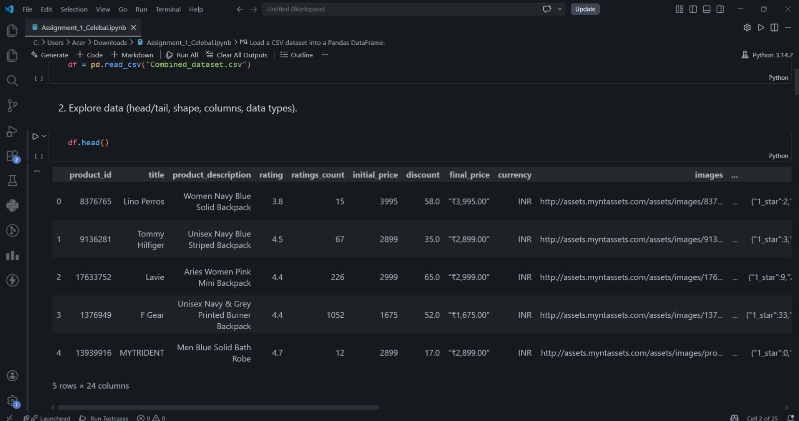
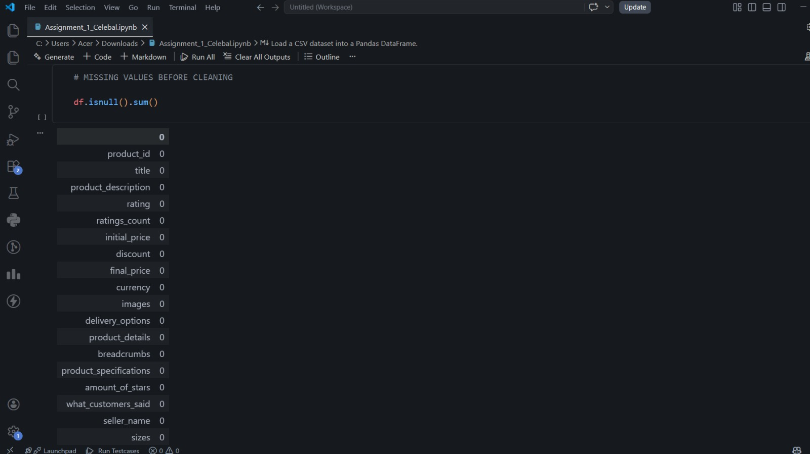
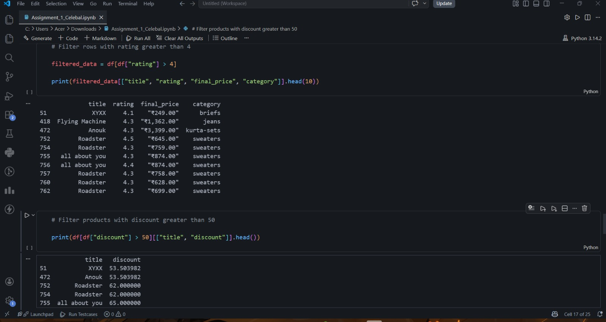

# Week 1: Data Exploration and Cleaning using Pandas

## Objective
The objective of this assignment was to learn Python basics and perform data exploration and cleaning using Pandas.

## Tasks Performed
- Loaded the CSV dataset into a Pandas DataFrame.
- Explored the dataset using `head()`, `tail()`, `shape`, and `info()`.
- Handled missing values and removed duplicates.
- Filtered and selected relevant data.
- Created derived columns (`quantity` and `total_amount`).
- Saved the cleaned dataset as a new CSV file.

## Tools Used
- Python
- Pandas
- Jupyter Notebook

## Files Included
- `Assignment_1_Celebal.ipynb`
- `cleaned_dataset.csv`
- `README.md`
- output 1.jpeg
- output 2.jpeg
- output 3.jpeg

## Output Screenshots

### Dataset Preview

### Data Cleaning

### Filtered Data

## Learning Outcomes
- Data exploration using Pandas.
- Handling missing values and duplicates.
- Data filtering and transformation.
- Creating derived features.
- Exporting cleaned datasets.

## Conclusion
This assignment provided hands-on experience in data preprocessing and basic data analysis using Python and Pandas.

---
**Celebal Technologies Data Engineering Internship | Week 1**
